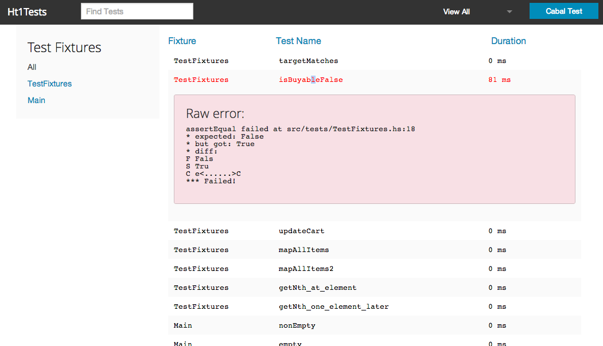

htf-viewer
===========

The goal of this project is to provide a pretty viewable view of HTF haskell tests, kind of like what karma does for
javascript tests.  A node server will listen for HTF test output changes, parse them, and do a push to a local angularUI
for pretty display.

Installation
======

```
> npm install htf-viewer -g
```

And to run, go to your haskell source directory and run

```
> htf-viewer
```

Use Case
======
Personally I write my haskell these days in sublime text, and while the console `cabal test` output is fine and dandy
sometimes I wish I would see the results of all the tests, and not just the failed ones.  HTF, I noticed, writes test results
to a specific log file in a format like:

```
Test suite Ht1Tests: RUNNING...
[TEST] TestFixtures:targetMatches (src/tests/TestFixtures.hs:15)
+++ OK (0ms)

[TEST] TestFixtures:isBuyableFalse (src/tests/TestFixtures.hs:18)
assertEqual failed at src/tests/TestFixtures.hs:18
* expected: False
* but got: True
* diff:
F Fals
S Tru
C e<......>C
*** Failed! (81ms)

[TEST] TestFixtures:updateCart (src/tests/TestFixtures.hs:21)
+++ OK (0ms)

* Tests:    4
* Passed:   4
* Pending:  0
* Failures: 0
* Errors:   0

Total execution time: 90ms
Test suite Tutorial: PASS
Test suite logged to: dist/test/HTF-0.11.0.1-Tutorial.log
```

And I thought it'd be fun (and look nice) to be able to spin up a browser and have these files auto watched.  This way I can get a
clean overview of what all my tests did in a constantly ready UI.


Configuration
=======

If you want, you can specify the project source and port in a `hconfig.json` file
in your haskell directory.  However, by default it will use port 3000 and use the local directory
as the haskell project root. Your haskell projects should be a cabalized project using HTF.

```
{
    "projectSource": "/Users/devshorts/Projects/code/haskellProject",
    "port": 3000
}
```

Running
=======

Load up the app with `node app.js`.  After that, test-viewer will listen for HTF log file changes in the `dist/test/*.log`
folder and re-parse any haskell test output files after they are detected to have been changed.  Failed parsings are
ignored.

Hitting the `cabal test` button does what it says it'll do. It'll run cabal test for the configured project source, which
will trigger a re-parse of the output test files.


Screen Shots
=======




Development
=======
If you want to add the to the repo, you'll need the following installed

- typescript
- node
- foundation
- compass
- ruby
- haskell (with HTF) (optional, but why wouldn't you?)
